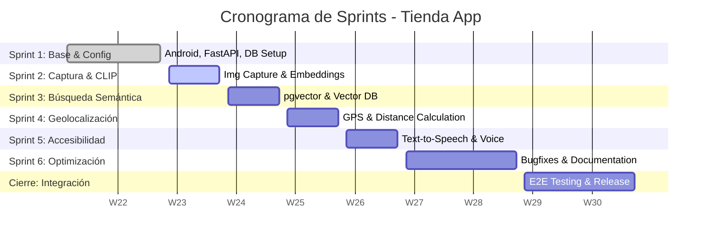

# REPORTE DE AVANCES Y PLANIFICACIÓN DE SPRINTS (TIENDA APP)

Este documento contiene el desglose y el estado actual de los avances por Sprint para la aplicación móvil **Tienda App** (Cliente Android + API FastAPI + PostgreSQL).

---

## 1. Cuadro de Mando del Proyecto (Roadmap)

| Sprint | Semana | Objetivos Principales | Estado | Avance Técnico |
| :--- | :---: | :--- | :---: | :---: |
| **Sprint 1** | Semana 2 | Configuración Android, FastAPI, PostgreSQL, permisos y diseño preliminar. | **Completado** | 100% |
| **Sprint 2** | Semana 3 | Captura de imágenes, envío al backend, integración CLIP y generación de embeddings. | *Siguiente* | Planificado |
| **Sprint 3** | Semana 4 | Configuración de pgvector, registro de embeddings y búsqueda semántica. | *Pendiente* | Planificado |
| **Sprint 4** | Semana 5 | Integración de GPS, obtención de coordenadas y cálculo de distancias. | *Pendiente* | Planificado |
| **Sprint 5** | Semana 6 | Accesibilidad (alto contraste, TalkBack) e interacción por voz (Text-to-Speech). | *Pendiente* | Planificado |
| **Sprint 6** | Semanas 7–8 | Pruebas unitarias, depuración, optimización de velocidad y documentación. | *Pendiente* | Planificado |
| **Integración** | Semana 9 | Integración completa de módulos y pruebas generales end-to-end. | *Pendiente* | Planificado |
| **Entrega Final**| Semana 10 | Validación final con usuarios, empaquetado (.AAB/.APK) y sustentación. | *Pendiente* | Planificado |

---

## 2. Cronograma Visual (Mermaid)

---

## 3. Detalle de Avance por Sprint

### 🟢 SPRINT 1 – Configuración y Base del Proyecto (Completado)
**Enfoque:** Configurar los cimientos del cliente móvil Android, el servidor de API en FastAPI, la persistencia en PostgreSQL y el diseño de la sesión del usuario.

*   **Avance Android (`tienda_app`):**
    *   Arquitectura base del proyecto con componentes de interfaz para escaneo, búsqueda y mapas.
    *   Clase de persistencia segura de credenciales y perfiles: [AuthManager.kt](file:///c:/Users/laszlo/Downloads/uni/des%20app/lab%201%20y%202/tienda_app/app/src/main/java/com/example/tienda_app/util/AuthManager.kt).
    *   Gestor de preferencias de accesibilidad local (Alto contraste y Asistente de Audio): [SettingsManager.kt](file:///c:/Users/laszlo/Downloads/uni/des%20app/lab%201%20y%202/tienda_app/app/src/main/java/com/example/tienda_app/util/SettingsManager.kt).
    *   Definición de rutas HTTP de cliente con Retrofit: [ApiService.kt](file:///c:/Users/laszlo/Downloads/uni/des%20app/lab%201%20y%202/tienda_app/app/src/main/java/com/example/tienda_app/api/ApiService.kt).
    *   Repositorio local tolerante a fallos de conexión: [ProductRepository.kt](file:///c:/Users/laszlo/Downloads/uni/des%20app/lab%201%20y%202/tienda_app/app/src/main/java/com/example/tienda_app/api/ProductRepository.kt).
*   **Avance FastAPI + PostgreSQL (Trabajado Aparte):**
    *   Estructura base del framework FastAPI, middleware CORS y enrutamiento modular.
    *   Configuración de la base de datos relacional PostgreSQL usando SQLAlchemy ORM.
    *   Modelos de datos (`User`, `Product`, `ProductImage`, `History`, `PushToken`) implementados.
    *   Seguridad mediante hash de contraseñas (bcrypt) y firma de tokens JWT.
    *   Endpoints iniciales implementados que coinciden con los contratos del cliente Android:
        *   `/api/auth/register` (Registro de usuarios)
        *   `/api/auth/login` (Autenticación y generación de JWT)
        *   `/api/notifications/register-token` (Almacenamiento de tokens FCM de dispositivos)
        *   `/history` (Arreglo plano con el historial de búsquedas del usuario)
        *   `/api/products/identify` (Multipart file upload para imágenes de productos)
        *   `/api/products/voice` (Búsqueda basada en transcripción de texto a partir de voz)

---

### 🟡 SPRINT 2 – Captura y Procesamiento de Imágenes (Siguiente Sprint)
**Enfoque:** Desarrollar los flujos de captura de imágenes físicas, transferencia segura al servidor backend y procesamiento visual mediante modelos CLIP para generar embeddings.

*   **Objetivos del Frontend (Android):**
    *   Integración robusta de la cámara mediante CameraX o Intent local.
    *   Redimensionamiento y compresión de imágenes en JPEG antes del envío para optimizar ancho de banda.
    *   Envío multipart de la imagen mediante `ApiService.identifyProduct` con animaciones visuales de carga en `AnalyzingFragment`.
*   **Objetivos del Backend (FastAPI):**
    *   Controlador receptor de archivos multipart en `/api/products/identify`.
    *   Instalación y carga en memoria del modelo preentrenado CLIP (`sentence-transformers/clip-ViT-B-32` o similar).
    *   Función extractora de vectores a partir de la imagen recibida, retornando los embeddings numéricos (normalmente vector de flotantes de dimensión 512).

---

### 🔴 SPRINT 3 – Base de Datos Vectorial (Semana 4)
**Enfoque:** Configuración de la extensión pgvector en PostgreSQL para almacenamiento, indexación y búsqueda por similitud de cosenos de embeddings visuales.

*   **Objetivos del Backend (FastAPI + PostgreSQL):**
    *   Instalación y activación de la extensión `pgvector` en la base de datos PostgreSQL.
    *   Modificación de la columna `embedding` en la tabla `products` a tipo de dato `Vector(512)`.
    *   Creación de índices de búsqueda rápida (ej. IVFFlat o HNSW) sobre la columna de embeddings.
    *   Implementación del cálculo de similitud mediante similitud de cosenos (`<=>`) para emparejar la imagen subida con la base de datos de productos.

---

### 🔴 SPRINT 4 – Localización de Tiendas (Semana 5)
**Enfoque:** Habilitar geolocalización en tiempo real para encontrar las tiendas físicas más cercanas que cuentan con disponibilidad del producto identificado.

*   **Objetivos del Frontend (Android):**
    *   Solicitud en tiempo real de permisos de localización precisa (`ACCESS_FINE_LOCATION`).
    *   Integración del mapa interactivo de Google Maps (`StoreMapFragment`) mostrando marcadores para cada sucursal física.
*   **Objetivos del Backend (FastAPI):**
    *   Modelo de datos y tabla para `stores` con latitud y longitud.
    *   Cálculo de distancias geométricas (fórmula de Haversine o utilidades espaciales de PostGIS/PostgreSQL) para filtrar y ordenar tiendas por distancia respecto al usuario.

---

### 🔴 SPRINT 5 – Accesibilidad e Interacción por Voz (Semana 6)
**Enfoque:** Garantizar una experiencia accesible para usuarios con discapacidades visuales o motoras mediante Text-to-Speech y mejoras UI de alto contraste.

*   **Objetivos del Frontend (Android):**
    *   Inicialización del motor `TextToSpeech` de Android para dictar descripciones de productos y resultados por voz.
    *   Integración profunda del "Modo de Alto Contraste" persistido, cambiando dinámicamente colores de fondo y texto (temas de alto contraste accesibles).
    *   Validación de etiquetas `contentDescription` en todos los componentes interactivos de la interfaz para compatibilidad completa con TalkBack.

---

### 🔴 SPRINT 6 – Pruebas y Optimización (Semanas 7–8)
**Enfoque:** Asegurar la calidad del sistema integrado, optimizar la latencia y corregir errores funcionales.

*   **Objetivos Generales:**
    *   Pruebas unitarias de llamadas Retrofit e interceptores.
    *   Pruebas de latencia del modelo CLIP y optimización de base de datos PostgreSQL.
    *   Elaboración de la documentación de arquitectura, diagramas de despliegue e informes finales.
