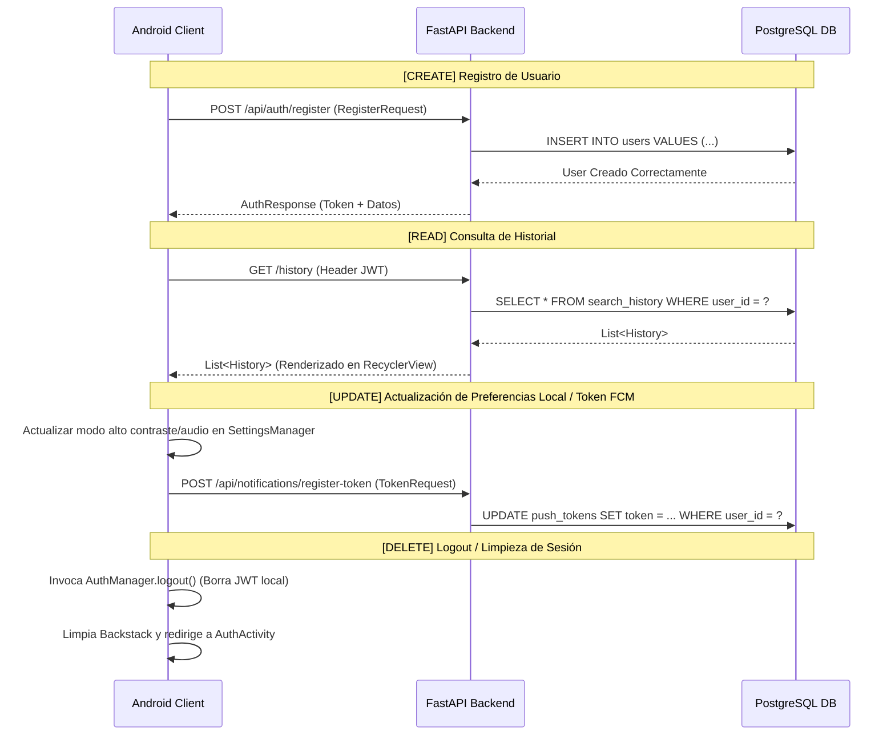

# INFORME DE EVIDENCIAS: CONEXIÓN A SERVICIOS WEB Y OPERACIONES CRUD EN TIENDA APP

Este documento presenta el reporte detallado y la evidencia técnica sobre la integración de servicios web y el funcionamiento de las operaciones CRUD (Creación, Lectura, Actualización y Eliminación) en la aplicación móvil **Tienda App** (Android + FastAPI + PostgreSQL).

---

## 1. Evidencia de Conexión a Servicios Web

La integración de la aplicación con la API RESTful (desarrollada en FastAPI) se realiza mediante la librería de red **Retrofit 2** optimizada con **OkHttp 3** para Android.

### A. Configuración de Base de Datos y URL Base
La dirección base del servicio está centralizada para facilitar despliegues locales y externos (como túneles seguros `ngrok`):

*   **Archivo de Configuración:** [Constants.kt](file:///c:/Users/laszlo/Downloads/uni/des%20app/lab%201%20y%202/tienda_app/app/src/main/java/com/example/tienda_app/Constants.kt)
*   **Código de Inicialización:**
    ```kotlin
    object Constants {
        const val API_BASE_URL = "  https://4b8c-190-119-162-157.ngrok-free.app"
        const val MAPS_API_KEY = BuildConfig.MAPS_API_KEY
    }
    ```

### B. Inicialización del Cliente HTTP y Singleton Retrofit
El ciclo de vida del cliente Retrofit se controla de forma segura mediante un Singleton que inyecta los interceptores y convertidores adecuados:

*   **Archivo del Controlador:** [ApiController.kt](file:///c:/Users/laszlo/Downloads/uni/des%20app/lab%201%20y%202/tienda_app/app/src/main/java/com/example/tienda_app/api/ApiController.kt)
*   **Detalle Técnico:** En el método `init(context)`, se construye la instancia única utilizando `GsonConverterFactory` para la serialización y un `OkHttpClient` configurado con políticas de seguridad JWT.

### C. Seguridad e Interceptor de Autenticación
Para garantizar llamadas seguras a los endpoints protegidos por el backend, se implementa un interceptor dinámico:

*   **Clase Interceptora:** [AuthInterceptor.kt](file:///c:/Users/laszlo/Downloads/uni/des%20app/lab%201%20y%202/tienda_app/app/src/main/java/com/example/tienda_app/api/AuthInterceptor.kt)
*   **Características del Flujo:**
    1.  **Inyección automática de Tokens:** Si existe un token JWT válido guardado localmente, se añade el encabezado `Authorization: Bearer <token>` a cada solicitud de forma transparente.
    2.  **Manejo del Error 401 (Sesión Expirada):** Si el servidor retorna un estado `401 Unauthorized`, el interceptor detecta la invalidación de la sesión, limpia las preferencias locales usando el [AuthManager.kt](file:///c:/Users/laszlo/Downloads/uni/des%20app/lab%201%20y%202/tienda_app/app/src/main/java/com/example/tienda_app/util/AuthManager.kt), y redirige de inmediato al usuario al flujo de inicio de sesión (`AuthActivity`), borrando la pila de navegación para evitar accesos indebidos.

### D. Interfaz de Rutas API
Los contratos y tipos de datos de intercambio se definen formalmente en la interfaz:

*   **Contrato de Red:** [ApiService.kt](file:///c:/Users/laszlo/Downloads/uni/des%20app/lab%201%20y%202/tienda_app/app/src/main/java/com/example/tienda_app/api/ApiService.kt)
*   **Rutas Registradas:**
    *   `POST api/auth/register` - Registro de nuevos usuarios.
    *   `POST api/auth/login` - Autenticación y obtención de JWT.
    *   `GET history` - Obtención del historial de análisis del usuario.
    *   `POST api/products/identify` (Multipart) - Carga de imágenes para el análisis CLIP.
    *   `GET api/products/voice` - Consultas basadas en búsquedas por comandos de voz.
    *   `POST api/notifications/register-token` - Registro del token de notificaciones FCM.

---

## 2. Manejo de Datos y Tolerancia a Fallos

El manejo de datos en la aplicación cumple con criterios de robustez técnica, control de excepciones y persistencia local:

### A. Serialización e Inferencia de Tipos
Toda respuesta JSON del backend se deserializa a objetos fuertemente tipados en Kotlin, como se detalla en:
*   [History.kt](file:///c:/Users/laszlo/Downloads/uni/des%20app/lab%201%20y%202/tienda_app/app/src/main/java/com/example/tienda_app/model/History.kt)
*   [ProductAnalysis.kt](file:///c:/Users/laszlo/Downloads/uni/des%20app/lab%201%20y%202/tienda_app/app/src/main/java/com/example/tienda_app/model/ProductAnalysis.kt)

### B. Persistencia Local Segura
Para la información de sesión de usuario, se utiliza `SharedPreferences` de Android a través de la clase controladora [AuthManager.kt](file:///c:/Users/laszlo/Downloads/uni/des%20app/lab%201%20y%202/tienda_app/app/src/main/java/com/example/tienda_app/util/AuthManager.kt). Esto permite mantener al usuario conectado tras reiniciar la aplicación y acceder rápidamente al token JWT.

### C. Mecanismo de Tolerancia a Fallas Offline (Fallback)
Para asegurar que la aplicación mantenga su operatividad ante caídas del servidor o falta de internet, se implementa una estrategia híbrida en el repositorio:

*   **Clase Repositorio:** [ProductRepository.kt](file:///c:/Users/laszlo/Downloads/uni/des%20app/lab%201%20y%202/tienda_app/app/src/main/java/com/example/tienda_app/api/ProductRepository.kt)
*   **Funcionamiento:**
    ```kotlin
    suspend fun getProducts(query: String): List<ProductAnalysis> {
        return try {
            val historyItems = ApiController.api.getHistory()
            val mapped = historyItems.map { history ->
                // Mapeo dinámico a ProductAnalysis
            }
            // Retorna datos de la API
        } catch (e: Exception) {
            // Ante cualquier error de red/servidor caída, retorna el dataset local fallback sin romper la experiencia
            searchLocal(query)
        }
    }
    ```
    *   **Beneficio:** Evita crasheos inesperados en la UI y proporciona datos mock de respaldo (`LOCAL_PRODUCTS`) de forma transparente al usuario.

---

## 3. Funcionalidades CRUD Operativas

A continuación, se detalla cómo se ejecuta cada una de las operaciones del ciclo CRUD sobre la arquitectura integrada del sistema:



### 🟩 CREATE (Creación)
*   **Creación de Cuentas (Usuarios):** Desde el [RegisterFragment.kt](file:///c:/Users/laszlo/Downloads/uni/des%20app/lab%201%20y%202/tienda_app/app/src/main/java/com/example/tienda_app/ui/auth/RegisterFragment.kt), se toman los campos del formulario (`username`, `email`, `password`), se validan en el cliente y se envían a `/api/auth/register`. El backend valida duplicados y los persiste en la tabla `users` usando hashing bcrypt.
*   **Carga de Imágenes (Historial de Escaneo):** Al capturar una foto o seleccionarla de la galería en [ScanFragment.kt](file:///c:/Users/laszlo/Downloads/uni/des%20app/lab%201%20y%202/tienda_app/app/src/main/java/com/example/tienda_app/ScanFragment.kt), el archivo se comprime y se envía como petición multipart mediante [AnalyzingFragment.kt](file:///c:/Users/laszlo/Downloads/uni/des%20app/lab%201%20y%202/tienda_app/app/src/main/java/com/example/tienda_app/AnalyzingFragment.kt) al endpoint `/api/products/identify`. Esto genera un registro persistente en el historial de búsqueda del usuario.
*   **Creación de Token FCM:** Al iniciar la sesión, se captura el token FCM del dispositivo y se guarda en el servidor en `/api/notifications/register-token` a través de [PushNotificationManager.kt](file:///c:/Users/laszlo/Downloads/uni/des%20app/lab%201%20y%202/tienda_app/app/src/main/java/com/example/tienda_app/util/PushNotificationManager.kt).

### 🟦 READ (Lectura)
*   **Inicio de Sesión:** El [LoginFragment.kt](file:///c:/Users/laszlo/Downloads/uni/des%20app/lab%201%20y%202/tienda_app/app/src/main/java/com/example/tienda_app/ui/auth/LoginFragment.kt) consume `/api/auth/login` para autenticar credenciales y recuperar el token JWT asociado al usuario.
*   **Historial de Búsquedas:** El [HistoryFrangment.kt](file:///c:/Users/laszlo/Downloads/uni/des%20app/lab%201%20y%202/tienda_app/app/src/main/java/com/example/tienda_app/HistoryFrangment.kt) llama a `getHistory()` de la API en una corrutina. Los resultados se inyectan en un `RecyclerView` dinámico manejado por el [HistoryAdapter.kt](file:///c:/Users/laszlo/Downloads/uni/des%20app/lab%201%20y%202/tienda_app/app/src/main/java/com/example/tienda_app/components/HistoryAdapter.kt).
*   **Buscador Inteligente:** El [SearchFragment.kt](file:///c:/Users/laszlo/Downloads/uni/des%20app/lab%201%20y%202/tienda_app/app/src/main/java/com/example/tienda_app/ui/search/SearchFragment.kt) realiza consultas textuales a través del [SearchViewModel.kt](file:///c:/Users/laszlo/Downloads/uni/des%20app/lab%201%20y%202/tienda_app/app/src/main/java/com/example/tienda_app/ui/search/SearchViewModel.kt) y lee el catálogo disponible filtrado por coincidencia semántica u offline.
*   **Búsqueda por Voz:** Desde el [VoiceSearchDialog.kt](file:///c:/Users/laszlo/Downloads/uni/des%20app/lab%201%20y%202/tienda_app/app/src/main/java/com/example/tienda_app/ui/search/VoiceSearchDialog.kt), se procesa el dictado de audio, se envía a la API en `/api/products/voice` y se retorna el listado de productos coincidentes.
*   **Lectura Detallada:** El [ProductDetailFragment.kt](file:///c:/Users/laszlo/Downloads/uni/des%20app/lab%201%20y%202/tienda_app/ProductDetailFragment.kt) carga y renderiza de manera estructurada los detalles complejos del producto (nombre, precios, características, especificaciones, imagen mediante Glide).

### 🟨 UPDATE (Actualización)
*   **Configuración y Accesibilidad:** En el [ConfigFragment.kt](file:///c:/Users/laszlo/Downloads/uni/des%20app/lab%201%20y%202/tienda_app/app/src/main/java/com/example/tienda_app/ConfigFragment.kt), las modificaciones en los estados de "Alto Contraste" y "Asistente de Voz" actualizan el [SettingsManager.kt](file:///c:/Users/laszlo/Downloads/uni/des%20app/lab%201%20y%202/tienda_app/app/src/main/java/com/example/tienda_app/util/SettingsManager.kt). El cambio altera inmediatamente los estilos visuales de la vista actual y los persiste localmente para futuras sesiones.
*   **Actualización de Token de Dispositivo:** Cada login o regeneración automática actualiza las referencias FCM en la tabla `push_tokens` del servidor para mantener la ruta de notificaciones activa.

### 🟥 DELETE (Eliminación)
*   **Cierre de Sesión:** En el [ConfigFragment.kt](file:///c:/Users/laszlo/Downloads/uni/des%20app/lab%201%20y%202/tienda_app/app/src/main/java/com/example/tienda_app/ConfigFragment.kt), el usuario puede cerrar sesión presionando el botón correspondiente. Esto desencadena `AuthManager.logout()` que elimina localmente el token JWT persistido y el objeto de datos del usuario, redirigiendo de inmediato a `AuthActivity` y eliminando todo historial de navegación del hilo actual.

---

## 4. Resumen de Criterios de Evaluación Cumplidos

| Criterio | Implementación Técnica y Ubicación del Código | Estado |
| :--- | :--- | :---: |
| **Correcta Integración** | Inicialización singleton en [ApiController.kt](file:///c:/Users/laszlo/Downloads/uni/des%20app/lab%201%20y%202/tienda_app/app/src/main/java/com/example/tienda_app/api/ApiController.kt), inyección en [MainActivity.kt](file:///c:/Users/laszlo/Downloads/uni/des%20app/lab%201%20y%202/tienda_app/app/src/main/java/com/example/tienda_app/MainActivity.kt) e interceptación de tráfico seguro con soporte de redirección por expiración en [AuthInterceptor.kt](file:///c:/Users/laszlo/Downloads/uni/des%20app/lab%201%20y%202/tienda_app/app/src/main/java/com/example/tienda_app/api/AuthInterceptor.kt). | **Cumplido** |
| **Manejo de Datos** | Deserialización JSON mediante Gson, persistencia persistente segura de variables en `SharedPreferences` con [AuthManager.kt](file:///c:/Users/laszlo/Downloads/uni/des%20app/lab%201%20y%202/tienda_app/app/src/main/java/com/example/tienda_app/util/AuthManager.kt), y tolerancia a fallos de red con fallback local incorporado en [ProductRepository.kt](file:///c:/Users/laszlo/Downloads/uni/des%20app/lab%201%20y%202/tienda_app/app/src/main/java/com/example/tienda_app/api/ProductRepository.kt). | **Cumplido** |
| **Funcionamiento del CRUD** | Acciones completas integradas: Creación de usuarios/análisis, lectura de listados de historial y búsquedas, actualización de perfiles de accesibilidad y tokens FCM, y eliminación de sesión/tokens en el cierre. | **Cumplido** |
